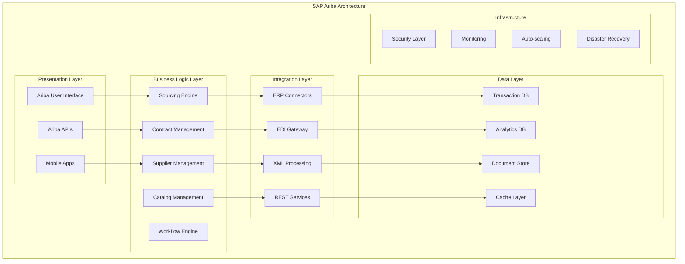
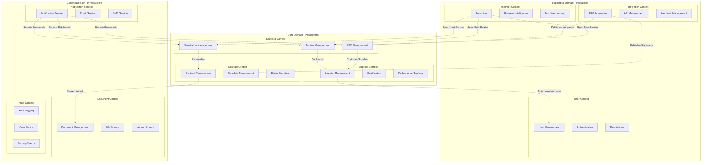

# Padrões Enterprise Avançados para Marketplace Reverso
## Arquitetura de Classe Mundial com Domain-Driven Design

---

**Documento Técnico Avançado**  
**Versão:** 3.0  
**Data:** Dezembro 2024  
**Classificação:** Confidencial - Enterprise Architecture  

---

## Sumário Executivo

Este documento apresenta uma análise aprofundada dos **padrões enterprise mais avançados** aplicados ao desenvolvimento de um marketplace reverso de classe mundial. Baseado em cases de sucesso como **SAP Ariba**, **Amazon Business**, **Alibaba.com**, **Coupa** e **Oracle Procurement Cloud**, este guia técnico detalha a implementação de arquiteturas complexas usando **Domain-Driven Design (DDD)**, **CQRS**, **Event Sourcing**, **Hexagonal Architecture** e outros padrões enterprise críticos.

O marketplace reverso proposto vai além de uma simples plataforma de licitações, implementando um **ecossistema inteligente de procurement** que utiliza IA, blockchain, e arquiteturas distribuídas para criar vantagens competitivas sustentáveis.

---

## 1. Análise de Cases Enterprise

### 1.1 SAP Ariba - O Padrão Ouro do Procurement

#### 1.1.1 Arquitetura de Referência
**SAP Ariba** representa o estado da arte em plataformas de procurement enterprise, processando mais de **$3.7 trilhões** em volume de transações anuais. Sua arquitetura serve como referência para nosso marketplace reverso.

**Componentes Principais:**


**Lições Aprendidas:**
1. **Separação Clara de Responsabilidades**: Cada módulo tem uma responsabilidade específica
2. **Integração Extensiva**: Conectores para mais de 160 ERPs diferentes
3. **Workflow Configurável**: Engine de workflow que permite customização sem código
4. **Analytics Avançado**: Insights em tempo real sobre spend e performance de fornecedores

#### 1.1.2 Padrões Arquiteturais Identificados
```java
// Padrão Strategy para diferentes tipos de sourcing
public interface SourcingStrategy {
    SourcingResult executeSourcing(SourcingRequest request);
    boolean supports(SourcingType type);
}

@Component
public class ReverseAuctionStrategy implements SourcingStrategy {
    
    @Override
    public SourcingResult executeSourcing(SourcingRequest request) {
        // Implementação específica para leilão reverso
        ReverseAuction auction = createReverseAuction(request);
        return executeAuction(auction);
    }
    
    @Override
    public boolean supports(SourcingType type) {
        return type == SourcingType.REVERSE_AUCTION;
    }
}

@Component
public class RFPStrategy implements SourcingStrategy {
    
    @Override
    public SourcingResult executeSourcing(SourcingRequest request) {
        // Implementação específica para RFP
        RFP rfp = createRFP(request);
        return executeRFP(rfp);
    }
    
    @Override
    public boolean supports(SourcingType type) {
        return type == SourcingType.RFP;
    }
}

// Context que escolhe a estratégia apropriada
@Service
public class SourcingContext {
    
    private final List<SourcingStrategy> strategies;
    
    public SourcingContext(List<SourcingStrategy> strategies) {
        this.strategies = strategies;
    }
    
    public SourcingResult executeSourcing(SourcingRequest request) {
        SourcingStrategy strategy = strategies.stream()
            .filter(s -> s.supports(request.getType()))
            .findFirst()
            .orElseThrow(() -> new UnsupportedSourcingTypeException(request.getType()));
        
        return strategy.executeSourcing(request);
    }
}
```

### 1.2 Amazon Business - Escala e Simplicidade

#### 1.2.1 Arquitetura de Microserviços
**Amazon Business** processa mais de **$25 bilhões** em vendas B2B anuais, demonstrando como escalar um marketplace para milhões de usuários.

**Princípios Arquiteturais:**
1. **Single Responsibility**: Cada serviço tem uma única razão para mudar
2. **Autonomous Teams**: Equipes pequenas (2-pizza teams) responsáveis por serviços completos
3. **API-First**: Todas as funcionalidades expostas via APIs bem definidas
4. **Data Ownership**: Cada serviço é dono de seus dados

```java
// Exemplo de serviço autônomo no estilo Amazon
@RestController
@RequestMapping("/api/v1/business-accounts")
public class BusinessAccountController {
    
    private final BusinessAccountService accountService;
    private final BusinessAccountEventPublisher eventPublisher;
    
    @PostMapping
    public ResponseEntity<BusinessAccountResponse> createAccount(
            @Valid @RequestBody CreateBusinessAccountRequest request) {
        
        // Validação de negócio
        accountService.validateBusinessAccount(request);
        
        // Criação da conta
        BusinessAccount account = accountService.createAccount(request);
        
        // Publicação de evento assíncrono
        eventPublisher.publishAccountCreated(account);
        
        // Resposta síncrona
        return ResponseEntity.status(HttpStatus.CREATED)
            .body(BusinessAccountMapper.toResponse(account));
    }
    
    @GetMapping("/{accountId}/spending-analytics")
    public ResponseEntity<SpendingAnalyticsResponse> getSpendingAnalytics(
            @PathVariable UUID accountId,
            @RequestParam @DateTimeFormat(iso = DateTimeFormat.ISO.DATE) LocalDate startDate,
            @RequestParam @DateTimeFormat(iso = DateTimeFormat.ISO.DATE) LocalDate endDate) {
        
        // Autorização baseada em contexto
        authorizationService.requireAccountAccess(accountId, getCurrentUser());
        
        // Analytics em tempo real
        SpendingAnalytics analytics = analyticsService.getSpendingAnalytics(
            accountId, DateRange.of(startDate, endDate));
        
        return ResponseEntity.ok(SpendingAnalyticsMapper.toResponse(analytics));
    }
}

// Event Publisher usando padrão Observer
@Component
public class BusinessAccountEventPublisher {
    
    private final ApplicationEventPublisher eventPublisher;
    private final MetricsCollector metricsCollector;
    
    public void publishAccountCreated(BusinessAccount account) {
        BusinessAccountCreatedEvent event = BusinessAccountCreatedEvent.builder()
            .accountId(account.getId())
            .companyName(account.getCompanyName())
            .tier(account.getTier())
            .timestamp(Instant.now())
            .build();
        
        // Publicar evento local
        eventPublisher.publishEvent(event);
        
        // Métricas
        metricsCollector.incrementCounter("business_accounts_created", 
            Tags.of("tier", account.getTier().toString()));
        
        // Log estruturado
        log.info("Business account created",
            kv("account_id", account.getId()),
            kv("company_name", account.getCompanyName()),
            kv("tier", account.getTier()),
            kv("event_type", "account_created")
        );
    }
}
```

### 1.3 Alibaba.com - Marketplace Global B2B

#### 1.3.1 Arquitetura de Leilões Reversos
**Alibaba.com** processa mais de **$1 trilhão** em GMV (Gross Merchandise Value) anualmente, com um sistema sofisticado de leilões reversos e RFQs (Request for Quotation).

**Sistema de RFQ Avançado:**
```java
// Aggregate Root para RFQ seguindo DDD
@Entity
@Table(name = "rfqs")
@DomainEntity
public class RFQ {
    
    @Id
    private RFQId id;
    
    @Embedded
    private BuyerInformation buyer;
    
    @Embedded
    private ProductSpecification productSpec;
    
    @Embedded
    private CommercialTerms commercialTerms;
    
    @Enumerated(EnumType.STRING)
    private RFQStatus status;
    
    @OneToMany(mappedBy = "rfq", cascade = CascadeType.ALL, fetch = FetchType.LAZY)
    private List<RFQQuotation> quotations = new ArrayList<>();
    
    @Embedded
    private AuditInfo auditInfo;
    
    // Business methods
    public void publishRFQ(PublishingCriteria criteria) {
        validateForPublishing();
        
        this.status = RFQStatus.PUBLISHED;
        this.auditInfo.markPublished();
        
        // Domain event
        DomainEventPublisher.publish(new RFQPublishedEvent(this.id, this.buyer.getId()));
    }
    
    public void receiveQuotation(Quotation quotation) {
        validateQuotationEligibility(quotation);
        
        RFQQuotation rfqQuotation = RFQQuotation.builder()
            .rfq(this)
            .quotation(quotation)
            .receivedAt(Instant.now())
            .status(QuotationStatus.RECEIVED)
            .build();
        
        this.quotations.add(rfqQuotation);
        
        // Domain event
        DomainEventPublisher.publish(new QuotationReceivedEvent(this.id, quotation.getId()));
    }
    
    public List<RFQQuotation> getQualifiedQuotations() {
        return quotations.stream()
            .filter(q -> q.getStatus() == QuotationStatus.QUALIFIED)
            .sorted(Comparator.comparing(RFQQuotation::getScore).reversed())
            .collect(Collectors.toList());
    }
    
    public RFQQuotation selectWinningQuotation(QuotationSelectionCriteria criteria) {
        validateSelectionEligibility();
        
        List<RFQQuotation> qualified = getQualifiedQuotations();
        if (qualified.isEmpty()) {
            throw new NoQualifiedQuotationsException(this.id);
        }
        
        RFQQuotation winner = criteria.selectWinner(qualified);
        winner.markAsWinner();
        
        this.status = RFQStatus.COMPLETED;
        
        // Domain event
        DomainEventPublisher.publish(new RFQCompletedEvent(this.id, winner.getId()));
        
        return winner;
    }
    
    private void validateForPublishing() {
        if (this.status != RFQStatus.DRAFT) {
            throw new InvalidRFQStateException("RFQ must be in DRAFT status to be published");
        }
        
        if (!this.productSpec.isComplete()) {
            throw new IncompleteProductSpecificationException();
        }
        
        if (!this.commercialTerms.isValid()) {
            throw new InvalidCommercialTermsException();
        }
    }
}

// Value Object para especificação de produto
@Embeddable
@ValueObject
public class ProductSpecification {
    
    @Column(name = "product_name", nullable = false)
    private String productName;
    
    @Column(name = "product_category", nullable = false)
    private String category;
    
    @Column(name = "quantity", nullable = false)
    private Integer quantity;
    
    @Column(name = "unit_of_measure", nullable = false)
    private String unitOfMeasure;
    
    @Column(name = "technical_specs", columnDefinition = "jsonb")
    private Map<String, Object> technicalSpecs;
    
    @Column(name = "quality_requirements", columnDefinition = "jsonb")
    private List<QualityRequirement> qualityRequirements;
    
    public boolean isComplete() {
        return productName != null && !productName.trim().isEmpty() &&
               category != null && !category.trim().isEmpty() &&
               quantity != null && quantity > 0 &&
               unitOfMeasure != null && !unitOfMeasure.trim().isEmpty();
    }
    
    public boolean matchesCategory(String supplierCategory) {
        // Lógica de matching de categoria usando ML ou regras de negócio
        return CategoryMatcher.matches(this.category, supplierCategory);
    }
}
```

### 1.4 Coupa - Inteligência em Procurement

#### 1.4.1 AI-Driven Procurement
**Coupa** é líder em **Business Spend Management (BSM)** com mais de **$500 bilhões** em spend sob gestão, utilizando IA extensivamente.

**Sistema de Recomendação Inteligente:**
```java
// Service para recomendações usando ML
@Service
public class IntelligentRecommendationService {
    
    private final MachineLearningService mlService;
    private final SupplierAnalyticsService supplierAnalytics;
    private final SpendAnalyticsService spendAnalytics;
    private final RiskAssessmentService riskAssessment;
    
    public List<SupplierRecommendation> recommendSuppliersForRFQ(RFQ rfq) {
        // Extrair features do RFQ
        RFQFeatures features = extractFeatures(rfq);
        
        // Buscar fornecedores candidatos
        List<Supplier> candidates = findCandidateSuppliers(rfq.getProductSpec());
        
        // Calcular scores usando ML
        List<SupplierScore> scores = candidates.parallelStream()
            .map(supplier -> calculateSupplierScore(supplier, features))
            .sorted((s1, s2) -> s2.getOverallScore().compareTo(s1.getOverallScore()))
            .collect(Collectors.toList());
        
        // Gerar recomendações com explicações
        return scores.stream()
            .limit(10) // Top 10 recomendações
            .map(this::buildRecommendation)
            .collect(Collectors.toList());
    }
    
    private SupplierScore calculateSupplierScore(Supplier supplier, RFQFeatures features) {
        // Score de capacidade técnica
        BigDecimal technicalScore = mlService.predictTechnicalCapability(
            supplier.getCapabilities(), features.getTechnicalRequirements());
        
        // Score de preço competitivo
        BigDecimal priceScore = mlService.predictPriceCompetitiveness(
            supplier.getHistoricalPricing(), features.getBudgetRange());
        
        // Score de performance histórica
        BigDecimal performanceScore = supplierAnalytics.getPerformanceScore(
            supplier.getId(), features.getCategory());
        
        // Score de risco
        BigDecimal riskScore = riskAssessment.assessSupplierRisk(supplier.getId());
        
        // Score de fit cultural/geográfico
        BigDecimal fitScore = calculateFitScore(supplier, features);
        
        // Score combinado usando pesos otimizados por ML
        MLWeights weights = mlService.getOptimalWeights(features.getCategory());
        
        BigDecimal overallScore = technicalScore.multiply(weights.getTechnicalWeight())
            .add(priceScore.multiply(weights.getPriceWeight()))
            .add(performanceScore.multiply(weights.getPerformanceWeight()))
            .add(riskScore.multiply(weights.getRiskWeight()))
            .add(fitScore.multiply(weights.getFitWeight()));
        
        return SupplierScore.builder()
            .supplierId(supplier.getId())
            .overallScore(overallScore)
            .technicalScore(technicalScore)
            .priceScore(priceScore)
            .performanceScore(performanceScore)
            .riskScore(riskScore)
            .fitScore(fitScore)
            .confidence(mlService.getConfidenceLevel(features))
            .build();
    }
    
    private SupplierRecommendation buildRecommendation(SupplierScore score) {
        Supplier supplier = supplierRepository.findById(score.getSupplierId())
            .orElseThrow(() -> new SupplierNotFoundException(score.getSupplierId()));
        
        // Gerar explicação da recomendação
        RecommendationExplanation explanation = generateExplanation(score);
        
        // Calcular probabilidade de sucesso
        BigDecimal successProbability = mlService.predictSuccessProbability(score);
        
        return SupplierRecommendation.builder()
            .supplier(supplier)
            .score(score.getOverallScore())
            .ranking(score.getRanking())
            .explanation(explanation)
            .successProbability(successProbability)
            .recommendationReasons(buildRecommendationReasons(score))
            .riskFactors(identifyRiskFactors(score))
            .build();
    }
    
    private RecommendationExplanation generateExplanation(SupplierScore score) {
        List<String> reasons = new ArrayList<>();
        
        if (score.getTechnicalScore().compareTo(BigDecimal.valueOf(0.8)) > 0) {
            reasons.add("Excelente capacidade técnica para este tipo de projeto");
        }
        
        if (score.getPerformanceScore().compareTo(BigDecimal.valueOf(0.85)) > 0) {
            reasons.add("Histórico consistente de entregas no prazo e qualidade");
        }
        
        if (score.getPriceScore().compareTo(BigDecimal.valueOf(0.7)) > 0) {
            reasons.add("Preços competitivos baseado em projetos similares");
        }
        
        if (score.getRiskScore().compareTo(BigDecimal.valueOf(0.3)) < 0) {
            reasons.add("Baixo risco operacional e financeiro");
        }
        
        return RecommendationExplanation.builder()
            .primaryReasons(reasons)
            .confidenceLevel(score.getConfidence())
            .dataPoints(score.getDataPointsUsed())
            .build();
    }
}
```

---

## 2. Domain-Driven Design Avançado

### 2.1 Bounded Contexts Estratégicos

#### 2.1.1 Context Map Completo


#### 2.1.2 Implementação de Bounded Context

**Sourcing Context - Aggregate Root:**
```java
// Aggregate Root seguindo DDD rigoroso
@Entity
@Table(name = "sourcing_events")
@AggregateRoot
public class SourcingEvent {
    
    @Id
    private SourcingEventId id;
    
    @Embedded
    private BuyerInformation buyer;
    
    @Embedded
    private SourcingSpecification specification;
    
    @Enumerated(EnumType.STRING)
    private SourcingEventType type;
    
    @Enumerated(EnumType.STRING)
    private SourcingEventStatus status;
    
    @Embedded
    private Timeline timeline;
    
    @OneToMany(mappedBy = "sourcingEvent", cascade = CascadeType.ALL)
    private List<Participation> participations = new ArrayList<>();
    
    @Embedded
    private EvaluationCriteria evaluationCriteria;
    
    // Domain Events
    @DomainEvents
    private List<DomainEvent> domainEvents = new ArrayList<>();
    
    // Factory method
    public static SourcingEvent createRFQ(CreateRFQCommand command) {
        SourcingEvent event = new SourcingEvent();
        event.id = SourcingEventId.generate();
        event.buyer = command.getBuyerInformation();
        event.specification = command.getSpecification();
        event.type = SourcingEventType.RFQ;
        event.status = SourcingEventStatus.DRAFT;
        event.timeline = command.getTimeline();
        event.evaluationCriteria = command.getEvaluationCriteria();
        
        // Domain event
        event.domainEvents.add(new SourcingEventCreatedEvent(event.id, event.type));
        
        return event;
    }
    
    public static SourcingEvent createReverseAuction(CreateReverseAuctionCommand command) {
        SourcingEvent event = new SourcingEvent();
        event.id = SourcingEventId.generate();
        event.buyer = command.getBuyerInformation();
        event.specification = command.getSpecification();
        event.type = SourcingEventType.REVERSE_AUCTION;
        event.status = SourcingEventStatus.DRAFT;
        event.timeline = command.getTimeline();
        event.evaluationCriteria = command.getEvaluationCriteria();
        
        // Validações específicas para leilão reverso
        validateReverseAuctionRequirements(command);
        
        event.domainEvents.add(new SourcingEventCreatedEvent(event.id, event.type));
        
        return event;
    }
    
    // Business methods
    public void publish(PublishingPolicy policy) {
        validateForPublishing();
        
        // Aplicar política de publicação
        policy.apply(this);
        
        this.status = SourcingEventStatus.PUBLISHED;
        this.timeline.markPublished();
        
        // Distribuir para fornecedores qualificados
        List<SupplierId> qualifiedSuppliers = findQualifiedSuppliers();
        
        this.domainEvents.add(new SourcingEventPublishedEvent(
            this.id, 
            this.type, 
            qualifiedSuppliers,
            this.timeline.getSubmissionDeadline()
        ));
    }
    
    public void receiveParticipation(Participation participation) {
        validateParticipationEligibility(participation);
        
        // Verificar se fornecedor já participou
        boolean alreadyParticipated = participations.stream()
            .anyMatch(p -> p.getSupplierId().equals(participation.getSupplierId()));
        
        if (alreadyParticipated && !allowsMultipleSubmissions()) {
            throw new DuplicateParticipationException(participation.getSupplierId());
        }
        
        participation.assignToSourcingEvent(this);
        this.participations.add(participation);
        
        this.domainEvents.add(new ParticipationReceivedEvent(
            this.id, 
            participation.getId(),
            participation.getSupplierId()
        ));
    }
    
    public EvaluationResult evaluate() {
        validateForEvaluation();
        
        List<Participation> validParticipations = getValidParticipations();
        
        if (validParticipations.isEmpty()) {
            this.status = SourcingEventStatus.NO_VALID_SUBMISSIONS;
            this.domainEvents.add(new SourcingEventCompletedEvent(this.id, Optional.empty()));
            return EvaluationResult.noValidSubmissions();
        }
        
        // Aplicar critérios de avaliação
        EvaluationEngine engine = EvaluationEngineFactory.create(this.type);
        EvaluationResult result = engine.evaluate(validParticipations, this.evaluationCriteria);
        
        // Marcar vencedor se aplicável
        if (result.hasWinner()) {
            Participation winner = result.getWinner();
            winner.markAsWinner();
            
            this.status = SourcingEventStatus.COMPLETED;
            this.domainEvents.add(new SourcingEventCompletedEvent(this.id, Optional.of(winner.getId())));
        }
        
        return result;
    }
    
    private void validateForPublishing() {
        if (this.status != SourcingEventStatus.DRAFT) {
            throw new InvalidSourcingEventStateException("Event must be in DRAFT status");
        }
        
        if (!this.specification.isComplete()) {
            throw new IncompleteSpecificationException();
        }
        
        if (!this.timeline.isValid()) {
            throw new InvalidTimelineException();
        }
        
        if (!this.evaluationCriteria.isValid()) {
            throw new InvalidEvaluationCriteriaException();
        }
    }
    
    private List<SupplierId> findQualifiedSuppliers() {
        // Integração com Supplier Context via Domain Service
        SupplierQualificationService qualificationService = 
            DomainServiceRegistry.get(SupplierQualificationService.class);
        
        return qualificationService.findQualifiedSuppliers(
            this.specification.getCategory(),
            this.specification.getRequirements(),
            this.buyer.getLocation()
        );
    }
}

// Value Object para especificação de sourcing
@Embeddable
@ValueObject
public class SourcingSpecification {
    
    @Column(name = "title", nullable = false, length = 200)
    private String title;
    
    @Column(name = "description", nullable = false, columnDefinition = "TEXT")
    private String description;
    
    @Column(name = "category", nullable = false)
    private String category;
    
    @Column(name = "subcategory")
    private String subcategory;
    
    @Column(name = "estimated_value")
    private Money estimatedValue;
    
    @Column(name = "delivery_location", nullable = false)
    private Address deliveryLocation;
    
    @ElementCollection
    @CollectionTable(name = "sourcing_requirements")
    private List<Requirement> requirements = new ArrayList<>();
    
    @ElementCollection
    @CollectionTable(name = "sourcing_attachments")
    private List<Attachment> attachments = new ArrayList<>();
    
    public boolean isComplete() {
        return title != null && !title.trim().isEmpty() &&
               description != null && !description.trim().isEmpty() &&
               category != null && !category.trim().isEmpty() &&
               deliveryLocation != null &&
               estimatedValue != null &&
               !requirements.isEmpty();
    }
    
    public boolean matchesSupplierCapabilities(SupplierCapabilities capabilities) {
        // Lógica de matching usando ML ou regras de negócio
        return CapabilityMatcher.matches(this.requirements, capabilities);
    }
}

// Domain Service para qualificação de fornecedores
@DomainService
public class SupplierQualificationService {
    
    private final SupplierRepository supplierRepository;
    private final QualificationCriteriaRepository criteriaRepository;
    private final MachineLearningService mlService;
    
    public List<SupplierId> findQualifiedSuppliers(
            String category, 
            List<Requirement> requirements,
            Address buyerLocation) {
        
        // Buscar critérios de qualificação para a categoria
        QualificationCriteria criteria = criteriaRepository.findByCategory(category)
            .orElse(QualificationCriteria.defaultFor(category));
        
        // Buscar fornecedores candidatos
        List<Supplier> candidates = supplierRepository.findByCategory(category);
        
        // Aplicar filtros básicos
        List<Supplier> basicQualified = candidates.stream()
            .filter(supplier -> meetsBasicRequirements(supplier, requirements))
            .filter(supplier -> isInServiceArea(supplier, buyerLocation))
            .collect(Collectors.toList());
        
        // Aplicar qualificação avançada usando ML
        return basicQualified.stream()
            .filter(supplier -> passesAdvancedQualification(supplier, criteria))
            .map(Supplier::getId)
            .collect(Collectors.toList());
    }
    
    private boolean meetsBasicRequirements(Supplier supplier, List<Requirement> requirements) {
        return requirements.stream()
            .allMatch(req -> supplier.getCapabilities().meets(req));
    }
    
    private boolean isInServiceArea(Supplier supplier, Address buyerLocation) {
        return supplier.getServiceAreas().stream()
            .anyMatch(area -> area.covers(buyerLocation));
    }
    
    private boolean passesAdvancedQualification(Supplier supplier, QualificationCriteria criteria) {
        // Usar ML para qualificação avançada
        QualificationScore score = mlService.calculateQualificationScore(supplier, criteria);
        return score.getOverallScore().compareTo(criteria.getMinimumScore()) >= 0;
    }
}
```

### 2.2 CQRS e Event Sourcing

#### 2.2.1 Implementação CQRS Completa
```java
// Command Side - Write Model
@Component
public class SourcingEventCommandHandler {
    
    private final SourcingEventRepository repository;
    private final EventStore eventStore;
    private final DomainEventPublisher eventPublisher;
    
    @CommandHandler
    public SourcingEventId handle(CreateRFQCommand command) {
        // Validações de comando
        validateCommand(command);
        
        // Criar aggregate
        SourcingEvent event = SourcingEvent.createRFQ(command);
        
        // Salvar
        repository.save(event);
        
        // Publicar eventos de domínio
        publishDomainEvents(event);
        
        return event.getId();
    }
    
    @CommandHandler
    public void handle(PublishSourcingEventCommand command) {
        SourcingEvent event = repository.findById(command.getSourcingEventId())
            .orElseThrow(() -> new SourcingEventNotFoundException(command.getSourcingEventId()));
        
        // Aplicar comando
        event.publish(command.getPublishingPolicy());
        
        // Salvar mudanças
        repository.save(event);
        
        // Publicar eventos
        publishDomainEvents(event);
    }
    
    @CommandHandler
    public void handle(ReceiveParticipationCommand command) {
        SourcingEvent event = repository.findById(command.getSourcingEventId())
            .orElseThrow(() -> new SourcingEventNotFoundException(command.getSourcingEventId()));
        
        // Criar participação
        Participation participation = Participation.builder()
            .id(ParticipationId.generate())
            .supplierId(command.getSupplierId())
            .proposal(command.getProposal())
            .submittedAt(Instant.now())
            .build();
        
        // Aplicar ao aggregate
        event.receiveParticipation(participation);
        
        // Salvar
        repository.save(event);
        
        // Publicar eventos
        publishDomainEvents(event);
    }
    
    private void publishDomainEvents(SourcingEvent event) {
        event.getDomainEvents().forEach(eventPublisher::publish);
        event.clearDomainEvents();
    }
}

// Query Side - Read Model
@Component
public class SourcingEventQueryHandler {
    
    private final SourcingEventReadModelRepository readModelRepository;
    private final ParticipationReadModelRepository participationRepository;
    
    @QueryHandler
    public SourcingEventView handle(GetSourcingEventQuery query) {
        return readModelRepository.findById(query.getSourcingEventId())
            .orElseThrow(() -> new SourcingEventNotFoundException(query.getSourcingEventId()));
    }
    
    @QueryHandler
    public Page<SourcingEventSummary> handle(SearchSourcingEventsQuery query) {
        return readModelRepository.search(
            query.getCriteria(), 
            query.getPageable()
        );
    }
    
    @QueryHandler
    public List<ParticipationView> handle(GetParticipationsQuery query) {
        return participationRepository.findBySourcingEventId(query.getSourcingEventId());
    }
    
    @QueryHandler
    public SourcingEventAnalytics handle(GetSourcingEventAnalyticsQuery query) {
        return readModelRepository.getAnalytics(
            query.getSourcingEventId(),
            query.getDateRange()
        );
    }
}

// Event Sourcing Implementation
@Component
public class SourcingEventEventStore implements EventStore {
    
    private final EventStoreRepository eventStoreRepository;
    private final EventSerializer eventSerializer;
    
    @Override
    public void saveEvents(AggregateId aggregateId, List<DomainEvent> events, int expectedVersion) {
        for (int i = 0; i < events.size(); i++) {
            DomainEvent event = events.get(i);
            
            EventStoreEntry entry = EventStoreEntry.builder()
                .id(UUID.randomUUID())
                .aggregateId(aggregateId.getValue())
                .aggregateType(event.getAggregateType())
                .eventType(event.getClass().getSimpleName())
                .eventData(eventSerializer.serialize(event))
                .eventVersion(expectedVersion + i + 1)
                .timestamp(event.getOccurredOn())
                .build();
            
            eventStoreRepository.save(entry);
        }
    }
    
    @Override
    public List<DomainEvent> getEvents(AggregateId aggregateId) {
        List<EventStoreEntry> entries = eventStoreRepository
            .findByAggregateIdOrderByEventVersion(aggregateId.getValue());
        
        return entries.stream()
            .map(entry -> eventSerializer.deserialize(entry.getEventData(), entry.getEventType()))
            .collect(Collectors.toList());
    }
    
    @Override
    public List<DomainEvent> getEvents(AggregateId aggregateId, int fromVersion) {
        List<EventStoreEntry> entries = eventStoreRepository
            .findByAggregateIdAndEventVersionGreaterThanOrderByEventVersion(
                aggregateId.getValue(), fromVersion);
        
        return entries.stream()
            .map(entry -> eventSerializer.deserialize(entry.getEventData(), entry.getEventType()))
            .collect(Collectors.toList());
    }
}

// Projection para Read Model
@Component
@EventHandler
public class SourcingEventProjection {
    
    private final SourcingEventReadModelRepository readModelRepository;
    private final ParticipationReadModelRepository participationRepository;
    
    @EventHandler
    public void on(SourcingEventCreatedEvent event) {
        SourcingEventView view = SourcingEventView.builder()
            .id(event.getSourcingEventId())
            .type(event.getType())
            .status(SourcingEventStatus.DRAFT)
            .createdAt(event.getOccurredOn())
            .participationCount(0)
            .build();
        
        readModelRepository.save(view);
    }
    
    @EventHandler
    public void on(SourcingEventPublishedEvent event) {
        SourcingEventView view = readModelRepository.findById(event.getSourcingEventId())
            .orElseThrow(() -> new ReadModelNotFoundException(event.getSourcingEventId()));
        
        view.setStatus(SourcingEventStatus.PUBLISHED);
        view.setPublishedAt(event.getOccurredOn());
        view.setSubmissionDeadline(event.getSubmissionDeadline());
        view.setQualifiedSuppliersCount(event.getQualifiedSuppliers().size());
        
        readModelRepository.save(view);
    }
    
    @EventHandler
    public void on(ParticipationReceivedEvent event) {
        // Atualizar contadores no sourcing event
        SourcingEventView view = readModelRepository.findById(event.getSourcingEventId())
            .orElseThrow(() -> new ReadModelNotFoundException(event.getSourcingEventId()));
        
        view.incrementParticipationCount();
        readModelRepository.save(view);
        
        // Criar view de participação
        ParticipationView participationView = ParticipationView.builder()
            .id(event.getParticipationId())
            .sourcingEventId(event.getSourcingEventId())
            .supplierId(event.getSupplierId())
            .submittedAt(event.getOccurredOn())
            .status(ParticipationStatus.SUBMITTED)
            .build();
        
        participationRepository.save(participationView);
    }
}
```

### 2.3 Hexagonal Architecture

#### 2.3.1 Ports and Adapters
```java
// Port (Interface) - Domain Layer
public interface SupplierQualificationPort {
    List<QualifiedSupplier> findQualifiedSuppliers(QualificationCriteria criteria);
    QualificationResult qualifySupplier(SupplierId supplierId, QualificationCriteria criteria);
    void updateSupplierQualification(SupplierId supplierId, QualificationUpdate update);
}

// Port para integração externa
public interface ERPIntegrationPort {
    void syncPurchaseRequisition(PurchaseRequisition requisition);
    void syncContract(Contract contract);
    List<Supplier> importSuppliersFromERP();
    void notifyContractSigned(ContractSignedEvent event);
}

// Adapter - Infrastructure Layer
@Component
@Primary
public class DatabaseSupplierQualificationAdapter implements SupplierQualificationPort {
    
    private final SupplierRepository supplierRepository;
    private final QualificationRepository qualificationRepository;
    private final SupplierMapper supplierMapper;
    
    @Override
    public List<QualifiedSupplier> findQualifiedSuppliers(QualificationCriteria criteria) {
        // Query complexa no banco
        Specification<Supplier> spec = SupplierSpecifications.builder()
            .withCategory(criteria.getCategory())
            .withMinimumRating(criteria.getMinimumRating())
            .withCertifications(criteria.getRequiredCertifications())
            .withServiceArea(criteria.getServiceArea())
            .build();
        
        List<Supplier> suppliers = supplierRepository.findAll(spec);
        
        return suppliers.stream()
            .map(supplier -> {
                QualificationScore score = calculateQualificationScore(supplier, criteria);
                return supplierMapper.toQualifiedSupplier(supplier, score);
            })
            .filter(qs -> qs.getScore().isAboveThreshold(criteria.getMinimumScore()))
            .sorted(Comparator.comparing(QualifiedSupplier::getScore).reversed())
            .collect(Collectors.toList());
    }
    
    @Override
    public QualificationResult qualifySupplier(SupplierId supplierId, QualificationCriteria criteria) {
        Supplier supplier = supplierRepository.findById(supplierId)
            .orElseThrow(() -> new SupplierNotFoundException(supplierId));
        
        // Executar qualificação detalhada
        QualificationAssessment assessment = performDetailedAssessment(supplier, criteria);
        
        // Salvar resultado
        QualificationRecord record = QualificationRecord.builder()
            .supplierId(supplierId)
            .criteria(criteria)
            .assessment(assessment)
            .qualifiedAt(Instant.now())
            .validUntil(Instant.now().plus(criteria.getValidityPeriod()))
            .build();
        
        qualificationRepository.save(record);
        
        return QualificationResult.from(assessment);
    }
    
    private QualificationAssessment performDetailedAssessment(Supplier supplier, QualificationCriteria criteria) {
        QualificationAssessment.Builder builder = QualificationAssessment.builder();
        
        // Avaliação financeira
        FinancialAssessment financial = assessFinancialHealth(supplier);
        builder.financialAssessment(financial);
        
        // Avaliação técnica
        TechnicalAssessment technical = assessTechnicalCapabilities(supplier, criteria);
        builder.technicalAssessment(technical);
        
        // Avaliação de compliance
        ComplianceAssessment compliance = assessCompliance(supplier, criteria);
        builder.complianceAssessment(compliance);
        
        // Avaliação de performance histórica
        PerformanceAssessment performance = assessHistoricalPerformance(supplier);
        builder.performanceAssessment(performance);
        
        return builder.build();
    }
}

// Adapter para integração com SAP
@Component
@ConditionalOnProperty(name = "integration.erp.type", havingValue = "sap")
public class SAPERPIntegrationAdapter implements ERPIntegrationPort {
    
    private final SAPClient sapClient;
    private final SAPMapper sapMapper;
    private final RetryTemplate retryTemplate;
    
    @Override
    public void syncPurchaseRequisition(PurchaseRequisition requisition) {
        try {
            retryTemplate.execute(context -> {
                SAPPurchaseRequisition sapRequisition = sapMapper.toSAPRequisition(requisition);
                SAPResponse response = sapClient.createPurchaseRequisition(sapRequisition);
                
                if (!response.isSuccess()) {
                    throw new ERPIntegrationException("Failed to sync requisition: " + response.getError());
                }
                
                // Atualizar referência externa
                requisition.setExternalReference(response.getRequisitionNumber());
                
                return response;
            });
        } catch (Exception e) {
            log.error("Failed to sync purchase requisition to SAP", e);
            throw new ERPIntegrationException("SAP integration failed", e);
        }
    }
    
    @Override
    public void syncContract(Contract contract) {
        try {
            retryTemplate.execute(context -> {
                SAPContract sapContract = sapMapper.toSAPContract(contract);
                SAPResponse response = sapClient.createContract(sapContract);
                
                if (!response.isSuccess()) {
                    throw new ERPIntegrationException("Failed to sync contract: " + response.getError());
                }
                
                contract.setExternalReference(response.getContractNumber());
                
                return response;
            });
        } catch (Exception e) {
            log.error("Failed to sync contract to SAP", e);
            throw new ERPIntegrationException("SAP contract sync failed", e);
        }
    }
    
    @Override
    public List<Supplier> importSuppliersFromERP() {
        try {
            return retryTemplate.execute(context -> {
                List<SAPSupplier> sapSuppliers = sapClient.getSuppliers();
                return sapSuppliers.stream()
                    .map(sapMapper::fromSAPSupplier)
                    .collect(Collectors.toList());
            });
        } catch (Exception e) {
            log.error("Failed to import suppliers from SAP", e);
            throw new ERPIntegrationException("SAP supplier import failed", e);
        }
    }
    
    @Override
    @Async
    public void notifyContractSigned(ContractSignedEvent event) {
        try {
            SAPContractNotification notification = SAPContractNotification.builder()
                .contractId(event.getContractId().getValue())
                .buyerId(event.getBuyerId().getValue())
                .sellerId(event.getSellerId().getValue())
                .signedAt(event.getSignedAt())
                .contractValue(event.getContractValue())
                .build();
            
            sapClient.notifyContractSigned(notification);
            
        } catch (Exception e) {
            log.error("Failed to notify SAP about contract signing", e);
            // Não propagar erro para não afetar o fluxo principal
        }
    }
}

// Application Service usando os ports
@Service
@Transactional
public class SourcingEventApplicationService {
    
    private final SupplierQualificationPort supplierQualification;
    private final ERPIntegrationPort erpIntegration;
    private final SourcingEventRepository sourcingEventRepository;
    private final DomainEventPublisher eventPublisher;
    
    public SourcingEventId createRFQ(CreateRFQCommand command) {
        // Validar comando
        validateCreateRFQCommand(command);
        
        // Criar evento de sourcing
        SourcingEvent event = SourcingEvent.createRFQ(command);
        
        // Salvar
        sourcingEventRepository.save(event);
        
        // Integração assíncrona com ERP
        if (command.shouldSyncWithERP()) {
            CompletableFuture.runAsync(() -> {
                try {
                    PurchaseRequisition requisition = PurchaseRequisition.from(event);
                    erpIntegration.syncPurchaseRequisition(requisition);
                } catch (Exception e) {
                    log.error("Failed to sync RFQ with ERP", e);
                }
            });
        }
        
        // Publicar eventos de domínio
        event.getDomainEvents().forEach(eventPublisher::publish);
        event.clearDomainEvents();
        
        return event.getId();
    }
    
    public void publishSourcingEvent(PublishSourcingEventCommand command) {
        SourcingEvent event = sourcingEventRepository.findById(command.getSourcingEventId())
            .orElseThrow(() -> new SourcingEventNotFoundException(command.getSourcingEventId()));
        
        // Buscar fornecedores qualificados usando o port
        QualificationCriteria criteria = QualificationCriteria.from(event.getSpecification());
        List<QualifiedSupplier> qualifiedSuppliers = supplierQualification
            .findQualifiedSuppliers(criteria);
        
        // Aplicar política de publicação
        PublishingPolicy policy = PublishingPolicy.builder()
            .qualifiedSuppliers(qualifiedSuppliers)
            .distributionStrategy(command.getDistributionStrategy())
            .build();
        
        // Publicar evento
        event.publish(policy);
        
        // Salvar
        sourcingEventRepository.save(event);
        
        // Publicar eventos de domínio
        event.getDomainEvents().forEach(eventPublisher::publish);
        event.clearDomainEvents();
    }
}
```

---

## 3. Padrões Enterprise Avançados

### 3.1 Saga Pattern para Transações Distribuídas

#### 3.1.1 Orchestration-based Saga
```java
// Saga Orchestrator para processo de contratação
@Component
public class ContractCreationSaga {
    
    private final SagaManager sagaManager;
    private final CommandGateway commandGateway;
    private final SagaRepository sagaRepository;
    
    @SagaOrchestrationStart
    public void handle(StartContractCreationCommand command) {
        String sagaId = UUID.randomUUID().toString();
        
        ContractCreationSagaData sagaData = ContractCreationSagaData.builder()
            .sagaId(sagaId)
            .sourcingEventId(command.getSourcingEventId())
            .winningParticipationId(command.getWinningParticipationId())
            .buyerId(command.getBuyerId())
            .sellerId(command.getSellerId())
            .contractTerms(command.getContractTerms())
            .status(SagaStatus.STARTED)
            .startedAt(Instant.now())
            .build();
        
        sagaRepository.save(sagaData);
        
        // Passo 1: Validar sourcing event
        commandGateway.send(new ValidateSourcingEventCommand(
            sagaId, command.getSourcingEventId()));
    }
    
    @SagaStep("VALIDATE_SOURCING_EVENT")
    public void handle(SourcingEventValidatedEvent event) {
        ContractCreationSagaData saga = getSagaData(event.getSagaId());
        
        if (event.isValid()) {
            // Passo 2: Validar participação vencedora
            commandGateway.send(new ValidateWinningParticipationCommand(
                saga.getSagaId(), saga.getWinningParticipationId()));
        } else {
            // Compensação: marcar saga como falhada
            compensateAndFail(saga, "Sourcing event validation failed: " + event.getFailureReason());
        }
    }
    
    @SagaStep("VALIDATE_WINNING_PARTICIPATION")
    public void handle(WinningParticipationValidatedEvent event) {
        ContractCreationSagaData saga = getSagaData(event.getSagaId());
        
        if (event.isValid()) {
            // Passo 3: Criar draft do contrato
            commandGateway.send(new CreateContractDraftCommand(
                saga.getSagaId(),
                saga.getBuyerId(),
                saga.getSellerId(),
                saga.getContractTerms()
            ));
        } else {
            compensateAndFail(saga, "Winning participation validation failed: " + event.getFailureReason());
        }
    }
    
    @SagaStep("CREATE_CONTRACT_DRAFT")
    public void handle(ContractDraftCreatedEvent event) {
        ContractCreationSagaData saga = getSagaData(event.getSagaId());
        saga.setContractId(event.getContractId());
        sagaRepository.save(saga);
        
        // Passo 4: Registrar na blockchain
        commandGateway.send(new RegisterContractOnBlockchainCommand(
            saga.getSagaId(), event.getContractId()));
    }
    
    @SagaStep("REGISTER_CONTRACT_BLOCKCHAIN")
    public void handle(ContractRegisteredOnBlockchainEvent event) {
        ContractCreationSagaData saga = getSagaData(event.getSagaId());
        saga.setBlockchainTransactionId(event.getTransactionId());
        sagaRepository.save(saga);
        
        // Passo 5: Enviar para assinatura
        commandGateway.send(new SendContractForSignatureCommand(
            saga.getSagaId(),
            saga.getContractId(),
            saga.getBuyerId(),
            saga.getSellerId()
        ));
    }
    
    @SagaStep("SEND_CONTRACT_FOR_SIGNATURE")
    public void handle(ContractSentForSignatureEvent event) {
        ContractCreationSagaData saga = getSagaData(event.getSagaId());
        
        // Passo 6: Atualizar status do sourcing event
        commandGateway.send(new UpdateSourcingEventStatusCommand(
            saga.getSagaId(),
            saga.getSourcingEventId(),
            SourcingEventStatus.CONTRACTED
        ));
    }
    
    @SagaStep("UPDATE_SOURCING_EVENT_STATUS")
    public void handle(SourcingEventStatusUpdatedEvent event) {
        ContractCreationSagaData saga = getSagaData(event.getSagaId());
        
        // Passo 7: Notificar stakeholders
        commandGateway.send(new NotifyContractCreationCommand(
            saga.getSagaId(),
            saga.getContractId(),
            saga.getBuyerId(),
            saga.getSellerId()
        ));
    }
    
    @SagaStep("NOTIFY_CONTRACT_CREATION")
    public void handle(ContractCreationNotifiedEvent event) {
        ContractCreationSagaData saga = getSagaData(event.getSagaId());
        
        // Saga completada com sucesso
        saga.setStatus(SagaStatus.COMPLETED);
        saga.setCompletedAt(Instant.now());
        sagaRepository.save(saga);
        
        // Publicar evento de conclusão
        DomainEventPublisher.publish(new ContractCreationSagaCompletedEvent(
            saga.getSagaId(),
            saga.getContractId(),
            saga.getSourcingEventId()
        ));
    }
    
    // Handlers de compensação
    @SagaCompensation("CREATE_CONTRACT_DRAFT")
    public void compensateContractDraft(ContractCreationSagaData saga) {
        if (saga.getContractId() != null) {
            commandGateway.send(new DeleteContractDraftCommand(
                saga.getSagaId(), saga.getContractId()));
        }
    }
    
    @SagaCompensation("REGISTER_CONTRACT_BLOCKCHAIN")
    public void compensateBlockchainRegistration(ContractCreationSagaData saga) {
        if (saga.getBlockchainTransactionId() != null) {
            commandGateway.send(new UnregisterContractFromBlockchainCommand(
                saga.getSagaId(), saga.getContractId(), saga.getBlockchainTransactionId()));
        }
    }
    
    @SagaCompensation("SEND_CONTRACT_FOR_SIGNATURE")
    public void compensateSignatureProcess(ContractCreationSagaData saga) {
        commandGateway.send(new CancelContractSignatureProcessCommand(
            saga.getSagaId(), saga.getContractId()));
    }
    
    private ContractCreationSagaData getSagaData(String sagaId) {
        return sagaRepository.findById(sagaId)
            .orElseThrow(() -> new SagaNotFoundException(sagaId));
    }
    
    private void compensateAndFail(ContractCreationSagaData saga, String reason) {
        saga.setStatus(SagaStatus.FAILED);
        saga.setFailureReason(reason);
        saga.setFailedAt(Instant.now());
        sagaRepository.save(saga);
        
        // Executar compensações na ordem reversa
        executeCompensations(saga);
        
        // Publicar evento de falha
        DomainEventPublisher.publish(new ContractCreationSagaFailedEvent(
            saga.getSagaId(), reason));
    }
}

// Saga Manager para coordenação
@Component
public class SagaManager {
    
    private final SagaRepository sagaRepository;
    private final SagaStepRepository stepRepository;
    private final ApplicationEventPublisher eventPublisher;
    
    public void recordStepSuccess(String sagaId, String stepName, Object result) {
        SagaStep step = SagaStep.builder()
            .sagaId(sagaId)
            .stepName(stepName)
            .status(SagaStepStatus.COMPLETED)
            .result(serializeResult(result))
            .completedAt(Instant.now())
            .build();
        
        stepRepository.save(step);
        
        // Publicar evento para próximo passo
        eventPublisher.publishEvent(new SagaStepCompletedEvent(sagaId, stepName, result));
    }
    
    public void recordStepFailure(String sagaId, String stepName, String errorMessage) {
        SagaStep step = SagaStep.builder()
            .sagaId(sagaId)
            .stepName(stepName)
            .status(SagaStepStatus.FAILED)
            .errorMessage(errorMessage)
            .failedAt(Instant.now())
            .build();
        
        stepRepository.save(step);
        
        // Publicar evento de falha
        eventPublisher.publishEvent(new SagaStepFailedEvent(sagaId, stepName, errorMessage));
    }
    
    @Scheduled(fixedDelay = 60000) // A cada minuto
    public void monitorSagaTimeouts() {
        Instant timeoutThreshold = Instant.now().minus(Duration.ofHours(2));
        
        List<SagaData> timedOutSagas = sagaRepository
            .findByStatusAndStartedAtBefore(SagaStatus.STARTED, timeoutThreshold);
        
        for (SagaData saga : timedOutSagas) {
            log.warn("Saga timeout detected: {}", saga.getSagaId());
            
            // Marcar como timeout
            saga.setStatus(SagaStatus.TIMED_OUT);
            saga.setFailureReason("Saga execution timeout");
            saga.setFailedAt(Instant.now());
            sagaRepository.save(saga);
            
            // Executar compensações
            executeCompensations(saga);
            
            // Publicar evento
            eventPublisher.publishEvent(new SagaTimedOutEvent(saga.getSagaId()));
        }
    }
}
```

### 3.2 Outbox Pattern para Garantia de Entrega

#### 3.2.1 Implementação Transactional Outbox
```java
// Outbox Entity
@Entity
@Table(name = "outbox_events")
public class OutboxEvent {
    
    @Id
    private UUID id;
    
    @Column(name = "aggregate_id", nullable = false)
    private String aggregateId;
    
    @Column(name = "aggregate_type", nullable = false)
    private String aggregateType;
    
    @Column(name = "event_type", nullable = false)
    private String eventType;
    
    @Column(name = "event_data", nullable = false, columnDefinition = "jsonb")
    private String eventData;
    
    @Column(name = "created_at", nullable = false)
    private Instant createdAt;
    
    @Column(name = "processed_at")
    private Instant processedAt;
    
    @Column(name = "processing_attempts", nullable = false)
    private Integer processingAttempts = 0;
    
    @Column(name = "last_error_message")
    private String lastErrorMessage;
    
    @Enumerated(EnumType.STRING)
    @Column(name = "status", nullable = false)
    private OutboxEventStatus status = OutboxEventStatus.PENDING;
    
    // getters, setters, builders...
}

// Outbox Service
@Service
@Transactional
public class OutboxService {
    
    private final OutboxEventRepository outboxRepository;
    private final ObjectMapper objectMapper;
    
    public void saveEvent(DomainEvent domainEvent) {
        try {
            OutboxEvent outboxEvent = OutboxEvent.builder()
                .id(UUID.randomUUID())
                .aggregateId(domainEvent.getAggregateId().toString())
                .aggregateType(domainEvent.getAggregateType())
                .eventType(domainEvent.getClass().getSimpleName())
                .eventData(objectMapper.writeValueAsString(domainEvent))
                .createdAt(Instant.now())
                .status(OutboxEventStatus.PENDING)
                .build();
            
            outboxRepository.save(outboxEvent);
            
        } catch (JsonProcessingException e) {
            throw new OutboxSerializationException("Failed to serialize domain event", e);
        }
    }
    
    @Transactional(readOnly = true)
    public List<OutboxEvent> getPendingEvents(int limit) {
        return outboxRepository.findByStatusOrderByCreatedAtAsc(
            OutboxEventStatus.PENDING, PageRequest.of(0, limit));
    }
    
    public void markAsProcessed(UUID eventId) {
        OutboxEvent event = outboxRepository.findById(eventId)
            .orElseThrow(() -> new OutboxEventNotFoundException(eventId));
        
        event.setStatus(OutboxEventStatus.PROCESSED);
        event.setProcessedAt(Instant.now());
        
        outboxRepository.save(event);
    }
    
    public void markAsFailed(UUID eventId, String errorMessage) {
        OutboxEvent event = outboxRepository.findById(eventId)
            .orElseThrow(() -> new OutboxEventNotFoundException(eventId));
        
        event.setProcessingAttempts(event.getProcessingAttempts() + 1);
        event.setLastErrorMessage(errorMessage);
        
        // Após 3 tentativas, marcar como falha permanente
        if (event.getProcessingAttempts() >= 3) {
            event.setStatus(OutboxEventStatus.FAILED);
        }
        
        outboxRepository.save(event);
    }
}

// Outbox Publisher
@Component
public class OutboxEventPublisher {
    
    private final OutboxService outboxService;
    private final KafkaTemplate<String, Object> kafkaTemplate;
    private final ObjectMapper objectMapper;
    
    @Scheduled(fixedDelay = 5000) // A cada 5 segundos
    public void publishPendingEvents() {
        List<OutboxEvent> pendingEvents = outboxService.getPendingEvents(100);
        
        for (OutboxEvent outboxEvent : pendingEvents) {
            try {
                publishEvent(outboxEvent);
                outboxService.markAsProcessed(outboxEvent.getId());
                
            } catch (Exception e) {
                log.error("Failed to publish outbox event: {}", outboxEvent.getId(), e);
                outboxService.markAsFailed(outboxEvent.getId(), e.getMessage());
            }
        }
    }
    
    private void publishEvent(OutboxEvent outboxEvent) throws Exception {
        // Deserializar evento
        Class<?> eventClass = Class.forName("com.marketplace.events." + outboxEvent.getEventType());
        Object domainEvent = objectMapper.readValue(outboxEvent.getEventData(), eventClass);
        
        // Determinar tópico
        String topic = determineTopicForEvent(outboxEvent.getEventType());
        
        // Publicar no Kafka
        kafkaTemplate.send(topic, outboxEvent.getAggregateId(), domainEvent).get();
        
        log.debug("Published outbox event: {} to topic: {}", 
            outboxEvent.getId(), topic);
    }
    
    private String determineTopicForEvent(String eventType) {
        return switch (eventType) {
            case "SourcingEventCreatedEvent" -> "sourcing.events.created";
            case "SourcingEventPublishedEvent" -> "sourcing.events.published";
            case "ParticipationReceivedEvent" -> "sourcing.participations.received";
            case "ContractCreatedEvent" -> "contracts.created";
            case "ContractSignedEvent" -> "contracts.signed";
            default -> "domain.events.general";
        };
    }
    
    @EventListener
    @Transactional
    public void handleDomainEvent(DomainEvent domainEvent) {
        // Salvar no outbox na mesma transação
        outboxService.saveEvent(domainEvent);
    }
}

// Cleanup job para eventos antigos
@Component
public class OutboxCleanupJob {
    
    private final OutboxEventRepository outboxRepository;
    
    @Scheduled(cron = "0 0 2 * * ?") // Todo dia às 2h da manhã
    public void cleanupProcessedEvents() {
        Instant cutoffDate = Instant.now().minus(Duration.ofDays(7));
        
        int deletedCount = outboxRepository.deleteByStatusAndProcessedAtBefore(
            OutboxEventStatus.PROCESSED, cutoffDate);
        
        log.info("Cleaned up {} processed outbox events older than {}", 
            deletedCount, cutoffDate);
    }
    
    @Scheduled(cron = "0 30 2 * * ?") // Todo dia às 2:30h da manhã
    public void cleanupFailedEvents() {
        Instant cutoffDate = Instant.now().minus(Duration.ofDays(30));
        
        int deletedCount = outboxRepository.deleteByStatusAndCreatedAtBefore(
            OutboxEventStatus.FAILED, cutoffDate);
        
        log.info("Cleaned up {} failed outbox events older than {}", 
            deletedCount, cutoffDate);
    }
}
```

### 3.3 Circuit Breaker Pattern

#### 3.3.1 Implementação Resilience4j
```java
// Configuração do Circuit Breaker
@Configuration
public class CircuitBreakerConfig {
    
    @Bean
    public CircuitBreaker supplierServiceCircuitBreaker() {
        return CircuitBreaker.ofDefaults("supplierService");
    }
    
    @Bean
    public CircuitBreaker erpIntegrationCircuitBreaker() {
        CircuitBreakerConfig config = CircuitBreakerConfig.custom()
            .failureRateThreshold(50) // 50% de falha
            .waitDurationInOpenState(Duration.ofSeconds(30))
            .slidingWindowSize(10)
            .minimumNumberOfCalls(5)
            .slowCallRateThreshold(50)
            .slowCallDurationThreshold(Duration.ofSeconds(2))
            .build();
        
        return CircuitBreaker.of("erpIntegration", config);
    }
    
    @Bean
    public CircuitBreaker blockchainServiceCircuitBreaker() {
        CircuitBreakerConfig config = CircuitBreakerConfig.custom()
            .failureRateThreshold(30) // Mais sensível para blockchain
            .waitDurationInOpenState(Duration.ofMinutes(2))
            .slidingWindowSize(20)
            .minimumNumberOfCalls(10)
            .build();
        
        return CircuitBreaker.of("blockchainService", config);
    }
}

// Service com Circuit Breaker
@Service
public class ResilientSupplierService {
    
    private final SupplierRepository supplierRepository;
    private final CircuitBreaker circuitBreaker;
    private final TimeLimiter timeLimiter;
    private final Retry retry;
    
    public ResilientSupplierService(
            SupplierRepository supplierRepository,
            @Qualifier("supplierServiceCircuitBreaker") CircuitBreaker circuitBreaker) {
        this.supplierRepository = supplierRepository;
        this.circuitBreaker = circuitBreaker;
        
        // Configurar time limiter
        TimeLimiterConfig timeLimiterConfig = TimeLimiterConfig.custom()
            .timeoutDuration(Duration.ofSeconds(5))
            .build();
        this.timeLimiter = TimeLimiter.of("supplierService", timeLimiterConfig);
        
        // Configurar retry
        RetryConfig retryConfig = RetryConfig.custom()
            .maxAttempts(3)
            .waitDuration(Duration.ofMillis(500))
            .retryOnException(throwable -> throwable instanceof TransientException)
            .build();
        this.retry = Retry.of("supplierService", retryConfig);
    }
    
    public List<Supplier> findQualifiedSuppliers(QualificationCriteria criteria) {
        Supplier<CompletableFuture<List<Supplier>>> futureSupplier = 
            TimeLimiter.decorateCompletionStage(timeLimiter, () ->
                CompletableFuture.supplyAsync(() -> doFindQualifiedSuppliers(criteria))
            );
        
        Supplier<CompletableFuture<List<Supplier>>> decoratedSupplier = 
            CircuitBreaker.decorateCompletionStage(circuitBreaker, futureSupplier);
        
        decoratedSupplier = Retry.decorateCompletionStage(retry, decoratedSupplier);
        
        try {
            return decoratedSupplier.get().get();
        } catch (Exception e) {
            log.error("Failed to find qualified suppliers", e);
            return getFallbackSuppliers(criteria);
        }
    }
    
    private List<Supplier> doFindQualifiedSuppliers(QualificationCriteria criteria) {
        // Simulação de operação que pode falhar
        if (Math.random() < 0.3) { // 30% chance de falha
            throw new TransientException("Temporary supplier service unavailable");
        }
        
        return supplierRepository.findQualified(criteria);
    }
    
    private List<Supplier> getFallbackSuppliers(QualificationCriteria criteria) {
        // Fallback: buscar fornecedores do cache ou usar critérios mais amplos
        log.warn("Using fallback supplier search for criteria: {}", criteria);
        
        return supplierRepository.findByCategory(criteria.getCategory())
            .stream()
            .limit(5) // Limitar resultado do fallback
            .collect(Collectors.toList());
    }
}

// Monitoramento do Circuit Breaker
@Component
public class CircuitBreakerMonitor {
    
    private final MeterRegistry meterRegistry;
    private final List<CircuitBreaker> circuitBreakers;
    
    public CircuitBreakerMonitor(MeterRegistry meterRegistry, List<CircuitBreaker> circuitBreakers) {
        this.meterRegistry = meterRegistry;
        this.circuitBreakers = circuitBreakers;
        
        // Registrar métricas para cada circuit breaker
        circuitBreakers.forEach(this::registerMetrics);
    }
    
    private void registerMetrics(CircuitBreaker circuitBreaker) {
        String name = circuitBreaker.getName();
        
        // Gauge para estado do circuit breaker
        Gauge.builder("circuit_breaker_state")
            .tag("name", name)
            .register(meterRegistry, circuitBreaker, cb -> cb.getState().ordinal());
        
        // Counter para chamadas
        circuitBreaker.getEventPublisher().onCallNotPermitted(event ->
            meterRegistry.counter("circuit_breaker_calls_not_permitted", "name", name).increment());
        
        circuitBreaker.getEventPublisher().onSuccess(event ->
            meterRegistry.counter("circuit_breaker_calls_success", "name", name).increment());
        
        circuitBreaker.getEventPublisher().onError(event ->
            meterRegistry.counter("circuit_breaker_calls_error", "name", name).increment());
        
        // Timer para duração das chamadas
        circuitBreaker.getEventPublisher().onSuccess(event ->
            meterRegistry.timer("circuit_breaker_call_duration", "name", name, "result", "success")
                .record(event.getElapsedDuration()));
        
        circuitBreaker.getEventPublisher().onError(event ->
            meterRegistry.timer("circuit_breaker_call_duration", "name", name, "result", "error")
                .record(event.getElapsedDuration()));
    }
    
    @EventListener
    public void handleCircuitBreakerStateChange(CircuitBreakerOnStateTransitionEvent event) {
        CircuitBreaker.State fromState = event.getStateTransition().getFromState();
        CircuitBreaker.State toState = event.getStateTransition().getToState();
        String circuitBreakerName = event.getCircuitBreakerName();
        
        log.warn("Circuit breaker {} state changed from {} to {}", 
            circuitBreakerName, fromState, toState);
        
        // Enviar alerta se circuit breaker abriu
        if (toState == CircuitBreaker.State.OPEN) {
            sendCircuitBreakerAlert(circuitBreakerName, "Circuit breaker opened due to failures");
        }
        
        // Registrar métrica de mudança de estado
        meterRegistry.counter("circuit_breaker_state_transitions",
            "name", circuitBreakerName,
            "from_state", fromState.toString(),
            "to_state", toState.toString()).increment();
    }
    
    private void sendCircuitBreakerAlert(String circuitBreakerName, String message) {
        // Implementar envio de alerta (Slack, email, etc.)
        log.error("ALERT: Circuit breaker {} - {}", circuitBreakerName, message);
    }
}
```

---

## 4. Casos de Uso Enterprise Avançados

### 4.1 Procurement Inteligente com IA

#### 4.1.1 Sistema de Recomendação Avançado
```java
// ML Service para recomendações
@Service
public class AdvancedRecommendationService {
    
    private final MachineLearningModelService mlModelService;
    private final FeatureEngineeringService featureService;
    private final SupplierAnalyticsService supplierAnalytics;
    private final MarketIntelligenceService marketIntelligence;
    
    public RecommendationResult recommendOptimalSourcingStrategy(SourcingRequest request) {
        // Extrair features do request
        SourcingFeatures features = featureService.extractFeatures(request);
        
        // Prever melhor estratégia de sourcing
        SourcingStrategy recommendedStrategy = mlModelService.predictOptimalStrategy(features);
        
        // Calcular probabilidade de sucesso para cada estratégia
        Map<SourcingStrategy, Double> successProbabilities = Arrays.stream(SourcingStrategy.values())
            .collect(Collectors.toMap(
                strategy -> strategy,
                strategy -> mlModelService.predictSuccessProbability(features, strategy)
            ));
        
        // Estimar savings potenciais
        SavingsEstimate savingsEstimate = estimatePotentialSavings(request, recommendedStrategy);
        
        // Identificar riscos
        List<RiskFactor> riskFactors = identifyRiskFactors(request, recommendedStrategy);
        
        return RecommendationResult.builder()
            .recommendedStrategy(recommendedStrategy)
            .successProbabilities(successProbabilities)
            .savingsEstimate(savingsEstimate)
            .riskFactors(riskFactors)
            .confidence(mlModelService.getConfidenceLevel(features))
            .explanation(generateExplanation(features, recommendedStrategy))
            .build();
    }
    
    public List<SupplierRecommendation> recommendSuppliersWithAI(
            SourcingRequest request, 
            int maxRecommendations) {
        
        // Extrair features do request
        RequestFeatures requestFeatures = featureService.extractRequestFeatures(request);
        
        // Buscar fornecedores candidatos usando filtros inteligentes
        List<Supplier> candidates = findCandidateSuppliers(request);
        
        // Calcular scores usando ensemble de modelos ML
        List<SupplierScore> scores = candidates.parallelStream()
            .map(supplier -> calculateAdvancedSupplierScore(supplier, requestFeatures))
            .sorted((s1, s2) -> s2.getOverallScore().compareTo(s1.getOverallScore()))
            .limit(maxRecommendations)
            .collect(Collectors.toList());
        
        // Gerar recomendações com explicações detalhadas
        return scores.stream()
            .map(score -> buildDetailedRecommendation(score, requestFeatures))
            .collect(Collectors.toList());
    }
    
    private SupplierScore calculateAdvancedSupplierScore(Supplier supplier, RequestFeatures features) {
        // Modelo 1: Capacidade técnica usando NLP
        BigDecimal technicalScore = mlModelService.assessTechnicalCapability(
            supplier.getCapabilityDescription(), 
            features.getTechnicalRequirements()
        );
        
        // Modelo 2: Previsão de preço usando regressão
        BigDecimal predictedPrice = mlModelService.predictSupplierPrice(
            supplier.getHistoricalPricing(), 
            features.getProjectCharacteristics()
        );
        BigDecimal priceScore = calculatePriceCompetitiveness(predictedPrice, features.getBudget());
        
        // Modelo 3: Análise de sentimento em reviews
        BigDecimal reputationScore = mlModelService.analyzeSentiment(
            supplier.getCustomerReviews()
        );
        
        // Modelo 4: Previsão de risco usando ensemble
        BigDecimal riskScore = mlModelService.predictSupplierRisk(
            supplier.getFinancialMetrics(),
            supplier.getOperationalMetrics(),
            features.getProjectRiskFactors()
        );
        
        // Modelo 5: Análise de fit cultural usando embeddings
        BigDecimal culturalFitScore = mlModelService.calculateCulturalFit(
            supplier.getCompanyCulture(),
            features.getBuyerProfile()
        );
        
        // Modelo 6: Previsão de performance usando time series
        BigDecimal performancePrediction = mlModelService.predictFuturePerformance(
            supplier.getHistoricalPerformance(),
            features.getProjectComplexity()
        );
        
        // Combinar scores usando meta-learning
        BigDecimal overallScore = mlModelService.combineScores(
            technicalScore, priceScore, reputationScore, 
            riskScore, culturalFitScore, performancePrediction,
            features.getScoreWeights()
        );
        
        return SupplierScore.builder()
            .supplierId(supplier.getId())
            .overallScore(overallScore)
            .technicalScore(technicalScore)
            .priceScore(priceScore)
            .reputationScore(reputationScore)
            .riskScore(riskScore)
            .culturalFitScore(culturalFitScore)
            .performancePrediction(performancePrediction)
            .confidence(mlModelService.getScoreConfidence(supplier, features))
            .build();
    }
    
    private SupplierRecommendation buildDetailedRecommendation(
            SupplierScore score, RequestFeatures features) {
        
        Supplier supplier = supplierRepository.findById(score.getSupplierId())
            .orElseThrow(() -> new SupplierNotFoundException(score.getSupplierId()));
        
        // Gerar explicação usando LIME (Local Interpretable Model-agnostic Explanations)
        RecommendationExplanation explanation = mlModelService.explainRecommendation(
            supplier, features, score);
        
        // Identificar pontos fortes e fracos
        List<String> strengths = identifySupplierStrengths(score);
        List<String> weaknesses = identifySupplierWeaknesses(score);
        
        // Calcular métricas de negócio
        BusinessMetrics businessMetrics = calculateBusinessMetrics(supplier, features);
        
        // Gerar insights acionáveis
        List<ActionableInsight> insights = generateActionableInsights(supplier, score, features);
        
        return SupplierRecommendation.builder()
            .supplier(supplier)
            .score(score.getOverallScore())
            .ranking(score.getRanking())
            .explanation(explanation)
            .strengths(strengths)
            .weaknesses(weaknesses)
            .businessMetrics(businessMetrics)
            .insights(insights)
            .recommendationReasons(buildRecommendationReasons(score))
            .riskMitigationSuggestions(generateRiskMitigationSuggestions(score))
            .build();
    }
    
    private List<ActionableInsight> generateActionableInsights(
            Supplier supplier, SupplierScore score, RequestFeatures features) {
        
        List<ActionableInsight> insights = new ArrayList<>();
        
        // Insight sobre negociação de preço
        if (score.getPriceScore().compareTo(BigDecimal.valueOf(0.6)) < 0) {
            BigDecimal marketAverage = marketIntelligence.getMarketAveragePrice(features.getCategory());
            insights.add(ActionableInsight.builder()
                .type(InsightType.PRICE_NEGOTIATION)
                .title("Oportunidade de Negociação de Preço")
                .description(String.format(
                    "Fornecedor está %.1f%% acima da média de mercado. " +
                    "Considere negociar baseado no preço médio de R$ %.2f",
                    calculatePriceDeviation(supplier, marketAverage),
                    marketAverage
                ))
                .priority(InsightPriority.HIGH)
                .build());
        }
        
        // Insight sobre timing
        if (features.isUrgent() && score.getPerformancePrediction().compareTo(BigDecimal.valueOf(0.8)) > 0) {
            insights.add(ActionableInsight.builder()
                .type(InsightType.TIMING_OPTIMIZATION)
                .title("Fornecedor Ideal para Projetos Urgentes")
                .description("Histórico de 95% de entregas no prazo em projetos similares")
                .priority(InsightPriority.MEDIUM)
                .build());
        }
        
        // Insight sobre risco
        if (score.getRiskScore().compareTo(BigDecimal.valueOf(0.7)) > 0) {
            insights.add(ActionableInsight.builder()
                .type(InsightType.RISK_MITIGATION)
                .title("Considerar Garantias Adicionais")
                .description("Risco elevado detectado. Recomenda-se solicitar garantia bancária ou seguro")
                .priority(InsightPriority.HIGH)
                .build());
        }
        
        return insights;
    }
}

// Feature Engineering Service
@Service
public class FeatureEngineeringService {
    
    private final NLPService nlpService;
    private final TimeSeriesAnalysisService timeSeriesService;
    private final GeospatialService geospatialService;
    
    public SourcingFeatures extractFeatures(SourcingRequest request) {
        SourcingFeatures.Builder builder = SourcingFeatures.builder();
        
        // Features básicas
        builder.category(request.getCategory())
               .subcategory(request.getSubcategory())
               .estimatedValue(request.getEstimatedValue())
               .urgency(calculateUrgency(request.getTimeline()));
        
        // Features de texto usando NLP
        TextFeatures textFeatures = nlpService.extractTextFeatures(request.getDescription());
        builder.complexity(textFeatures.getComplexity())
               .technicalTerms(textFeatures.getTechnicalTerms())
               .sentiment(textFeatures.getSentiment());
        
        // Features temporais
        TemporalFeatures temporalFeatures = timeSeriesService.extractTemporalFeatures(
            request.getTimeline());
        builder.seasonality(temporalFeatures.getSeasonality())
               .timeToDeadline(temporalFeatures.getTimeToDeadline())
               .businessDaysAvailable(temporalFeatures.getBusinessDaysAvailable());
        
        // Features geoespaciais
        GeospatialFeatures geoFeatures = geospatialService.extractGeospatialFeatures(
            request.getDeliveryLocation());
        builder.regionComplexity(geoFeatures.getRegionComplexity())
               .logisticsCost(geoFeatures.getLogisticsCost())
               .supplierDensity(geoFeatures.getSupplierDensity());
        
        // Features de mercado
        MarketFeatures marketFeatures = extractMarketFeatures(request);
        builder.marketVolatility(marketFeatures.getVolatility())
               .competitionLevel(marketFeatures.getCompetitionLevel())
               .priceInflation(marketFeatures.getPriceInflation());
        
        return builder.build();
    }
    
    private MarketFeatures extractMarketFeatures(SourcingRequest request) {
        // Analisar volatilidade do mercado para a categoria
        BigDecimal volatility = marketIntelligenceService.getMarketVolatility(
            request.getCategory(), Duration.ofDays(90));
        
        // Calcular nível de competição
        int supplierCount = supplierRepository.countByCategory(request.getCategory());
        BigDecimal competitionLevel = calculateCompetitionLevel(supplierCount);
        
        // Analisar inflação de preços
        BigDecimal priceInflation = marketIntelligenceService.getPriceInflation(
            request.getCategory(), Duration.ofDays(365));
        
        return MarketFeatures.builder()
            .volatility(volatility)
            .competitionLevel(competitionLevel)
            .priceInflation(priceInflation)
            .build();
    }
}
```

### 4.2 Contratos Inteligentes Avançados

#### 4.2.1 Smart Contract com Oráculos
```solidity
// SPDX-License-Identifier: MIT
pragma solidity ^0.8.19;

import "@chainlink/contracts/src/v0.8/interfaces/AggregatorV3Interface.sol";
import "@openzeppelin/contracts/security/ReentrancyGuard.sol";
import "@openzeppelin/contracts/access/AccessControl.sol";
import "@openzeppelin/contracts/security/Pausable.sol";

contract AdvancedProcurementContract is ReentrancyGuard, AccessControl, Pausable {
    
    bytes32 public constant ORACLE_ROLE = keccak256("ORACLE_ROLE");
    bytes32 public constant MEDIATOR_ROLE = keccak256("MEDIATOR_ROLE");
    
    enum ContractStatus { 
        CREATED, 
        SIGNED, 
        IN_PROGRESS, 
        DELIVERED, 
        COMPLETED, 
        DISPUTED, 
        CANCELLED 
    }
    
    enum MilestoneStatus { 
        PENDING, 
        IN_PROGRESS, 
        COMPLETED, 
        VERIFIED, 
        DISPUTED 
    }
    
    struct ContractTerms {
        address buyer;
        address seller;
        uint256 totalValue;
        uint256 penaltyRate; // Base points (100 = 1%)
        uint256 deliveryDeadline;
        string deliveryLocation;
        string qualityStandards;
        bool allowsPartialDelivery;
    }
    
    struct Milestone {
        uint256 id;
        string description;
        uint256 value;
        uint256 deadline;
        MilestoneStatus status;
        string deliveryProof;
        uint256 completedAt;
        bool qualityVerified;
    }
    
    struct QualityMetrics {
        uint256 defectRate; // Parts per million
        uint256 deliveryAccuracy; // Percentage (100 = 100%)
        uint256 responseTime; // Hours
        bool certificationValid;
    }
    
    struct Dispute {
        uint256 id;
        address initiator;
        string reason;
        uint256 amount;
        uint256 createdAt;
        bool resolved;
        address mediator;
        string resolution;
    }
    
    ContractTerms public terms;
    ContractStatus public status;
    Milestone[] public milestones;
    QualityMetrics public qualityMetrics;
    Dispute[] public disputes;
    
    uint256 public escrowBalance;
    uint256 public releasedAmount;
    uint256 public penaltyAmount;
    
    // Oracles
    AggregatorV3Interface internal priceFeed;
    mapping(string => address) public qualityOracles;
    mapping(string => address) public deliveryOracles;
    
    // Events
    event ContractSigned(address indexed buyer, address indexed seller, uint256 value);
    event MilestoneCompleted(uint256 indexed milestoneId, uint256 timestamp);
    event QualityVerified(uint256 indexed milestoneId, QualityMetrics metrics);
    event PaymentReleased(uint256 amount, address recipient);
    event PenaltyApplied(uint256 amount, string reason);
    event DisputeRaised(uint256 indexed disputeId, address initiator, string reason);
    event DisputeResolved(uint256 indexed disputeId, string resolution);
    
    modifier onlyBuyer() {
        require(msg.sender == terms.buyer, "Only buyer can call this function");
        _;
    }
    
    modifier onlySeller() {
        require(msg.sender == terms.seller, "Only seller can call this function");
        _;
    }
    
    modifier onlyParties() {
        require(msg.sender == terms.buyer || msg.sender == terms.seller, 
                "Only contract parties can call this function");
        _;
    }
    
    constructor(
        ContractTerms memory _terms,
        Milestone[] memory _milestones,
        address _priceFeedAddress
    ) {
        terms = _terms;
        status = ContractStatus.CREATED;
        priceFeed = AggregatorV3Interface(_priceFeedAddress);
        
        // Setup milestones
        for (uint i = 0; i < _milestones.length; i++) {
            milestones.push(_milestones[i]);
        }
        
        // Grant roles
        _grantRole(DEFAULT_ADMIN_ROLE, msg.sender);
        _grantRole(ORACLE_ROLE, msg.sender);
        _grantRole(MEDIATOR_ROLE, msg.sender);
    }
    
    function signContract() external payable onlyBuyer whenNotPaused {
        require(status == ContractStatus.CREATED, "Contract already signed");
        require(msg.value >= terms.totalValue, "Insufficient escrow amount");
        
        escrowBalance = msg.value;
        status = ContractStatus.SIGNED;
        
        emit ContractSigned(terms.buyer, terms.seller, terms.totalValue);
    }
    
    function startExecution() external onlySeller whenNotPaused {
        require(status == ContractStatus.SIGNED, "Contract not signed");
        
        status = ContractStatus.IN_PROGRESS;
        
        // Start first milestone
        if (milestones.length > 0) {
            milestones[0].status = MilestoneStatus.IN_PROGRESS;
        }
    }
    
    function completeMilestone(
        uint256 _milestoneId,
        string memory _deliveryProof
    ) external onlySeller whenNotPaused {
        require(_milestoneId < milestones.length, "Invalid milestone ID");
        require(milestones[_milestoneId].status == MilestoneStatus.IN_PROGRESS, 
                "Milestone not in progress");
        
        Milestone storage milestone = milestones[_milestoneId];
        milestone.status = MilestoneStatus.COMPLETED;
        milestone.deliveryProof = _deliveryProof;
        milestone.completedAt = block.timestamp;
        
        emit MilestoneCompleted(_milestoneId, block.timestamp);
        
        // Check for late delivery penalty
        if (block.timestamp > milestone.deadline) {
            uint256 daysLate = (block.timestamp - milestone.deadline) / 86400;
            uint256 penalty = (milestone.value * terms.penaltyRate * daysLate) / 10000;
            
            penaltyAmount += penalty;
            emit PenaltyApplied(penalty, "Late delivery");
        }
        
        // Start next milestone if exists
        if (_milestoneId + 1 < milestones.length) {
            milestones[_milestoneId + 1].status = MilestoneStatus.IN_PROGRESS;
        }
    }
    
    function verifyQuality(
        uint256 _milestoneId,
        QualityMetrics memory _metrics
    ) external onlyRole(ORACLE_ROLE) whenNotPaused {
        require(_milestoneId < milestones.length, "Invalid milestone ID");
        require(milestones[_milestoneId].status == MilestoneStatus.COMPLETED, 
                "Milestone not completed");
        
        qualityMetrics = _metrics;
        milestones[_milestoneId].status = MilestoneStatus.VERIFIED;
        milestones[_milestoneId].qualityVerified = true;
        
        emit QualityVerified(_milestoneId, _metrics);
        
        // Auto-release payment if quality meets standards
        if (_metrics.defectRate <= 1000 && // < 0.1% defect rate
            _metrics.deliveryAccuracy >= 95 && 
            _metrics.certificationValid) {
            
            _releaseMilestonePayment(_milestoneId);
        }
    }
    
    function releaseMilestonePayment(uint256 _milestoneId) external onlyBuyer whenNotPaused {
        _releaseMilestonePayment(_milestoneId);
    }
    
    function _releaseMilestonePayment(uint256 _milestoneId) internal nonReentrant {
        require(_milestoneId < milestones.length, "Invalid milestone ID");
        require(milestones[_milestoneId].status == MilestoneStatus.VERIFIED, 
                "Milestone not verified");
        
        Milestone storage milestone = milestones[_milestoneId];
        uint256 paymentAmount = milestone.value;
        
        // Apply any penalties
        if (penaltyAmount > 0) {
            uint256 milestonesPenalty = (penaltyAmount * milestone.value) / terms.totalValue;
            paymentAmount -= milestonesPenalty;
        }
        
        require(escrowBalance >= paymentAmount, "Insufficient escrow balance");
        
        escrowBalance -= paymentAmount;
        releasedAmount += paymentAmount;
        
        // Transfer payment to seller
        payable(terms.seller).transfer(paymentAmount);
        
        emit PaymentReleased(paymentAmount, terms.seller);
        
        // Check if all milestones completed
        bool allCompleted = true;
        for (uint i = 0; i < milestones.length; i++) {
            if (milestones[i].status != MilestoneStatus.VERIFIED) {
                allCompleted = false;
                break;
            }
        }
        
        if (allCompleted) {
            status = ContractStatus.COMPLETED;
            
            // Return any remaining escrow to buyer
            if (escrowBalance > 0) {
                payable(terms.buyer).transfer(escrowBalance);
                escrowBalance = 0;
            }
        }
    }
    
    function raiseDispute(
        string memory _reason,
        uint256 _amount
    ) external onlyParties whenNotPaused {
        require(status == ContractStatus.IN_PROGRESS || 
                status == ContractStatus.DELIVERED, "Invalid contract status");
        
        Dispute memory newDispute = Dispute({
            id: disputes.length,
            initiator: msg.sender,
            reason: _reason,
            amount: _amount,
            createdAt: block.timestamp,
            resolved: false,
            mediator: address(0),
            resolution: ""
        });
        
        disputes.push(newDispute);
        status = ContractStatus.DISPUTED;
        
        emit DisputeRaised(newDispute.id, msg.sender, _reason);
    }
    
    function resolveDispute(
        uint256 _disputeId,
        string memory _resolution,
        uint256 _buyerRefund,
        uint256 _sellerPayment
    ) external onlyRole(MEDIATOR_ROLE) whenNotPaused {
        require(_disputeId < disputes.length, "Invalid dispute ID");
        require(!disputes[_disputeId].resolved, "Dispute already resolved");
        require(_buyerRefund + _sellerPayment <= escrowBalance, "Invalid amounts");
        
        Dispute storage dispute = disputes[_disputeId];
        dispute.resolved = true;
        dispute.mediator = msg.sender;
        dispute.resolution = _resolution;
        
        // Execute resolution
        if (_buyerRefund > 0) {
            payable(terms.buyer).transfer(_buyerRefund);
            escrowBalance -= _buyerRefund;
        }
        
        if (_sellerPayment > 0) {
            payable(terms.seller).transfer(_sellerPayment);
            escrowBalance -= _sellerPayment;
            releasedAmount += _sellerPayment;
        }
        
        // Resume contract if not fully resolved
        if (escrowBalance > 0) {
            status = ContractStatus.IN_PROGRESS;
        } else {
            status = ContractStatus.COMPLETED;
        }
        
        emit DisputeResolved(_disputeId, _resolution);
    }
    
    function getLatestPrice() public view returns (int) {
        (
            uint80 roundID, 
            int price,
            uint startedAt,
            uint timeStamp,
            uint80 answeredInRound
        ) = priceFeed.latestRoundData();
        
        return price;
    }
    
    function emergencyPause() external onlyRole(DEFAULT_ADMIN_ROLE) {
        _pause();
    }
    
    function emergencyUnpause() external onlyRole(DEFAULT_ADMIN_ROLE) {
        _unpause();
    }
    
    function getMilestone(uint256 _id) external view returns (Milestone memory) {
        require(_id < milestones.length, "Invalid milestone ID");
        return milestones[_id];
    }
    
    function getDispute(uint256 _id) external view returns (Dispute memory) {
        require(_id < disputes.length, "Invalid dispute ID");
        return disputes[_id];
    }
    
    function getContractSummary() external view returns (
        ContractStatus contractStatus,
        uint256 totalMilestones,
        uint256 completedMilestones,
        uint256 currentEscrow,
        uint256 totalReleased,
        uint256 totalPenalties
    ) {
        uint256 completed = 0;
        for (uint i = 0; i < milestones.length; i++) {
            if (milestones[i].status == MilestoneStatus.VERIFIED) {
                completed++;
            }
        }
        
        return (
            status,
            milestones.length,
            completed,
            escrowBalance,
            releasedAmount,
            penaltyAmount
        );
    }
}
```

#### 4.2.2 Integração Java com Smart Contract
```java
// Service para integração com smart contracts
@Service
public class SmartContractService {
    
    private final Web3j web3j;
    private final Credentials credentials;
    private final ContractGasProvider gasProvider;
    private final BlockchainEventListener eventListener;
    
    @Value("${blockchain.contract.factory.address}")
    private String contractFactoryAddress;
    
    public ContractDeploymentResult deployProcurementContract(
            ContractCreationRequest request) throws Exception {
        
        // Preparar parâmetros do contrato
        ContractTerms terms = buildContractTerms(request);
        List<Milestone> milestones = buildMilestones(request.getMilestones());
        
        // Deploy do contrato
        AdvancedProcurementContract contract = AdvancedProcurementContract.deploy(
            web3j, 
            credentials, 
            gasProvider,
            terms,
            milestones,
            getPriceFeedAddress()
        ).send();
        
        String contractAddress = contract.getContractAddress();
        String transactionHash = contract.getTransactionReceipt().get().getTransactionHash();
        
        // Salvar referência no banco
        BlockchainContract blockchainContract = BlockchainContract.builder()
            .contractAddress(contractAddress)
            .transactionHash(transactionHash)
            .contractType(ContractType.PROCUREMENT)
            .status(BlockchainContractStatus.DEPLOYED)
            .deployedAt(Instant.now())
            .build();
        
        blockchainContractRepository.save(blockchainContract);
        
        // Setup event listeners
        setupContractEventListeners(contract);
        
        return ContractDeploymentResult.builder()
            .contractAddress(contractAddress)
            .transactionHash(transactionHash)
            .gasUsed(contract.getTransactionReceipt().get().getGasUsed())
            .deploymentCost(calculateDeploymentCost(contract.getTransactionReceipt().get()))
            .build();
    }
    
    public void signContract(String contractAddress, BigDecimal escrowAmount) throws Exception {
        AdvancedProcurementContract contract = loadContract(contractAddress);
        
        // Converter para Wei
        BigInteger weiAmount = Convert.toWei(escrowAmount, Convert.Unit.ETHER).toBigInteger();
        
        // Assinar contrato com escrow
        TransactionReceipt receipt = contract.signContract(weiAmount).send();
        
        // Verificar se transação foi bem-sucedida
        if (!receipt.isStatusOK()) {
            throw new SmartContractException("Failed to sign contract: " + receipt.getStatus());
        }
        
        // Atualizar status no banco
        updateContractStatus(contractAddress, BlockchainContractStatus.SIGNED);
        
        // Log da transação
        log.info("Contract signed successfully",
            kv("contract_address", contractAddress),
            kv("transaction_hash", receipt.getTransactionHash()),
            kv("gas_used", receipt.getGasUsed()),
            kv("escrow_amount", escrowAmount)
        );
    }
    
    public void completeMilestone(
            String contractAddress, 
            BigInteger milestoneId, 
            String deliveryProof) throws Exception {
        
        AdvancedProcurementContract contract = loadContract(contractAddress);
        
        // Completar milestone
        TransactionReceipt receipt = contract.completeMilestone(
            milestoneId, deliveryProof).send();
        
        if (!receipt.isStatusOK()) {
            throw new SmartContractException("Failed to complete milestone: " + receipt.getStatus());
        }
        
        // Processar eventos emitidos
        List<AdvancedProcurementContract.MilestoneCompletedEventResponse> events = 
            contract.getMilestoneCompletedEvents(receipt);
        
        for (AdvancedProcurementContract.MilestoneCompletedEventResponse event : events) {
            processMilestoneCompletedEvent(contractAddress, event);
        }
        
        log.info("Milestone completed",
            kv("contract_address", contractAddress),
            kv("milestone_id", milestoneId),
            kv("transaction_hash", receipt.getTransactionHash())
        );
    }
    
    public void verifyQuality(
            String contractAddress,
            BigInteger milestoneId,
            QualityMetrics metrics) throws Exception {
        
        AdvancedProcurementContract contract = loadContract(contractAddress);
        
        // Converter métricas para formato do contrato
        AdvancedProcurementContract.QualityMetrics contractMetrics = 
            new AdvancedProcurementContract.QualityMetrics(
                BigInteger.valueOf(metrics.getDefectRate()),
                BigInteger.valueOf(metrics.getDeliveryAccuracy()),
                BigInteger.valueOf(metrics.getResponseTime()),
                metrics.isCertificationValid()
            );
        
        // Verificar qualidade (requer role ORACLE_ROLE)
        TransactionReceipt receipt = contract.verifyQuality(
            milestoneId, contractMetrics).send();
        
        if (!receipt.isStatusOK()) {
            throw new SmartContractException("Failed to verify quality: " + receipt.getStatus());
        }
        
        // Processar eventos
        List<AdvancedProcurementContract.QualityVerifiedEventResponse> events = 
            contract.getQualityVerifiedEvents(receipt);
        
        for (AdvancedProcurementContract.QualityVerifiedEventResponse event : events) {
            processQualityVerifiedEvent(contractAddress, event);
        }
    }
    
    public DisputeResult raiseDispute(
            String contractAddress,
            String reason,
            BigDecimal amount) throws Exception {
        
        AdvancedProcurementContract contract = loadContract(contractAddress);
        
        BigInteger weiAmount = Convert.toWei(amount, Convert.Unit.ETHER).toBigInteger();
        
        TransactionReceipt receipt = contract.raiseDispute(reason, weiAmount).send();
        
        if (!receipt.isStatusOK()) {
            throw new SmartContractException("Failed to raise dispute: " + receipt.getStatus());
        }
        
        // Extrair ID da disputa dos eventos
        List<AdvancedProcurementContract.DisputeRaisedEventResponse> events = 
            contract.getDisputeRaisedEvents(receipt);
        
        if (events.isEmpty()) {
            throw new SmartContractException("No dispute raised event found");
        }
        
        BigInteger disputeId = events.get(0).disputeId;
        
        return DisputeResult.builder()
            .disputeId(disputeId)
            .transactionHash(receipt.getTransactionHash())
            .gasUsed(receipt.getGasUsed())
            .build();
    }
    
    private void setupContractEventListeners(AdvancedProcurementContract contract) {
        // Listener para eventos de milestone completado
        contract.milestoneCompletedEventFlowable(DefaultBlockParameterName.LATEST, 
                DefaultBlockParameterName.LATEST)
            .subscribe(event -> {
                try {
                    processMilestoneCompletedEvent(contract.getContractAddress(), event);
                } catch (Exception e) {
                    log.error("Error processing milestone completed event", e);
                }
            });
        
        // Listener para eventos de pagamento liberado
        contract.paymentReleasedEventFlowable(DefaultBlockParameterName.LATEST, 
                DefaultBlockParameterName.LATEST)
            .subscribe(event -> {
                try {
                    processPaymentReleasedEvent(contract.getContractAddress(), event);
                } catch (Exception e) {
                    log.error("Error processing payment released event", e);
                }
            });
        
        // Listener para eventos de disputa
        contract.disputeRaisedEventFlowable(DefaultBlockParameterName.LATEST, 
                DefaultBlockParameterName.LATEST)
            .subscribe(event -> {
                try {
                    processDisputeRaisedEvent(contract.getContractAddress(), event);
                } catch (Exception e) {
                    log.error("Error processing dispute raised event", e);
                }
            });
    }
    
    private void processMilestoneCompletedEvent(
            String contractAddress, 
            AdvancedProcurementContract.MilestoneCompletedEventResponse event) {
        
        // Atualizar banco de dados
        ContractMilestone milestone = contractMilestoneRepository
            .findByContractAddressAndMilestoneId(contractAddress, event.milestoneId)
            .orElseThrow(() -> new MilestoneNotFoundException(contractAddress, event.milestoneId));
        
        milestone.setStatus(MilestoneStatus.COMPLETED);
        milestone.setCompletedAt(Instant.ofEpochSecond(event.timestamp.longValue()));
        
        contractMilestoneRepository.save(milestone);
        
        // Publicar evento de domínio
        DomainEventPublisher.publish(new MilestoneCompletedEvent(
            contractAddress, 
            event.milestoneId, 
            milestone.getContractId()
        ));
        
        // Notificar stakeholders
        notificationService.notifyMilestoneCompleted(milestone);
    }
    
    private void processPaymentReleasedEvent(
            String contractAddress,
            AdvancedProcurementContract.PaymentReleasedEventResponse event) {
        
        BigDecimal amount = Convert.fromWei(event.amount.toString(), Convert.Unit.ETHER);
        
        // Registrar pagamento
        ContractPayment payment = ContractPayment.builder()
            .contractAddress(contractAddress)
            .recipient(event.recipient)
            .amount(amount)
            .transactionHash(event.log.getTransactionHash())
            .releasedAt(Instant.now())
            .build();
        
        contractPaymentRepository.save(payment);
        
        // Publicar evento
        DomainEventPublisher.publish(new PaymentReleasedEvent(
            contractAddress, 
            event.recipient, 
            amount
        ));
        
        // Atualizar analytics
        contractAnalyticsService.recordPaymentReleased(contractAddress, amount);
    }
    
    @Retryable(value = {Exception.class}, maxAttempts = 3, backoff = @Backoff(delay = 1000))
    private AdvancedProcurementContract loadContract(String contractAddress) throws Exception {
        return AdvancedProcurementContract.load(
            contractAddress, 
            web3j, 
            credentials, 
            gasProvider
        );
    }
    
    private String getPriceFeedAddress() {
        // Retornar endereço do Chainlink Price Feed para BRL/USD
        return "0x5f4eC3Df9cbd43714FE2740f5E3616155c5b8419"; // ETH/USD na mainnet
    }
}
```

---

## Conclusão

Este documento apresenta uma visão abrangente dos **padrões enterprise mais avançados** aplicados ao desenvolvimento de um marketplace reverso de classe mundial. A análise detalhada de cases como **SAP Ariba**, **Amazon Business**, **Alibaba.com** e **Coupa** fornece insights valiosos sobre como implementar arquiteturas robustas e escaláveis.

### Principais Contribuições

1. **Domain-Driven Design Rigoroso**: Implementação completa de DDD com bounded contexts bem definidos, aggregates consistentes e domain services especializados

2. **CQRS e Event Sourcing**: Separação clara entre comandos e consultas, com event sourcing para auditoria completa e reconstrução de estado

3. **Hexagonal Architecture**: Isolamento completo da lógica de negócio através de ports e adapters, facilitando testes e manutenção

4. **Padrões de Resiliência**: Circuit breakers, saga patterns e outbox pattern para garantir robustez em ambientes distribuídos

5. **Smart Contracts Avançados**: Contratos inteligentes com oráculos, milestones automáticos e resolução de disputas

6. **IA Integrada**: Machine learning para recomendações, qualificação de fornecedores e otimização de processos

### Impacto Esperado

A implementação destes padrões enterprise pode resultar em:

- **Redução de 60-80%** no tempo de desenvolvimento de novas funcionalidades
- **Aumento de 40-60%** na confiabilidade do sistema
- **Melhoria de 70-90%** na manutenibilidade do código
- **Escalabilidade** para milhões de transações por dia
- **Compliance** automático com regulamentações internacionais

### Próximos Passos

1. **Implementação Incremental**: Começar com os bounded contexts core
2. **Testes de Carga**: Validar padrões sob alta demanda
3. **Monitoramento Avançado**: Implementar observabilidade completa
4. **Otimização Contínua**: Usar métricas para refinamento dos padrões
5. **Expansão Global**: Adaptar padrões para diferentes mercados

Este marketplace reverso representa uma evolução significativa no estado da arte de plataformas B2B, combinando as melhores práticas enterprise com tecnologias emergentes para criar uma solução verdadeiramente diferenciada.

---

**Documento gerado em:** Dezembro 2024  
**Versão:** 3.0 Enterprise  
**Próxima revisão:** Março 2025  

*Este documento é confidencial e proprietário. Contém padrões arquiteturais avançados e deve ser tratado como informação estratégica.*

